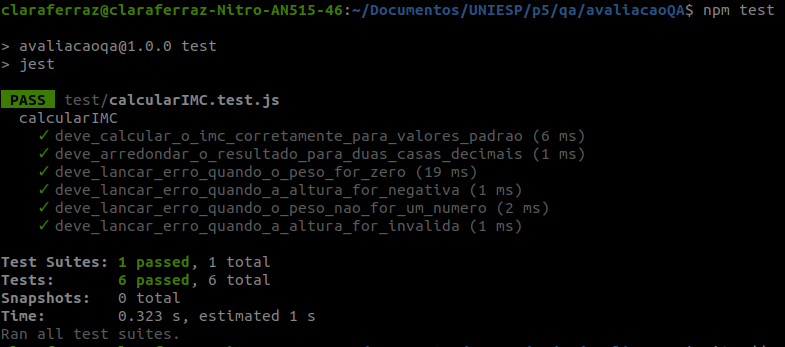

# 🩺 Calculadora de IMC (Índice de Massa Corporal)

Este projeto é parte da primeira avaliação da disciplina de Qualidade de Software. O projeto se trata de uma calculadora simples de Índice de Massa Corporal (IMC) a partir do peso e da altura. Foi desenvolvido em JavaScript e com testes unitários usando **Jest**.

---

## 🚀 Como Executar o Projeto

### Pré-requisitos

Certifique-se de ter o **Node.js** instalado em sua máquina.

### 1\. Clonar o Repositório

```bash
git clone git@github.com:claraferraz/avaliacaoQA.git
cd calculadora-imc
```

### 2\. Instalar Dependências

Este projeto utiliza o Jest como _framework_ de teste. Instale-o com o npm:

```bash
npm install
```

### 3\. Rodar a Aplicação (Exemplo)

O arquivo principal é o `src/calcularIMC.js`. Você pode importá-lo em qualquer script Node.js para usá-lo, por exemplo:

```javascript
const calcularIMC = require("./src/calcularIMC");

try {
	const peso = 75;
	const altura = 1.8;
	const imc = calcularIMC(peso, altura);

	console.log(`Peso: ${peso}kg, Altura: ${altura}m`);
	console.log(`Seu IMC é: ${imc}`);
	// Saída: Seu IMC é: 23.15
} catch (error) {
	console.error("Erro ao calcular IMC:", error.message);
}
```

---

## 🧪 Testes Unitários

Os testes unitários garantem que a função `calcularIMC` funcione corretamente, validando casos de sucesso, arredondamento e tratamento de erros.

### 1\. Rodar Todos os Testes

Use o comando `npm test` para executar todos os testes configurados com Jest:

```bash
npm test
```

### 2\. Visão Geral dos Testes

Os testes cobrem os seguintes cenários:

| Categoria   | Cenário de Teste                                | Assertiva                                       |
| :---------- | :---------------------------------------------- | :---------------------------------------------- |
| **Sucesso** | Cálculo padrão (70kg, 1.75m).                   | Deve retornar **22.86**.                        |
| **Sucesso** | Arredondamento preciso (para 2 casas decimais). | Deve retornar o valor arredondado corretamente. |
| **Exceção** | Peso igual a zero ou negativo.                  | Deve **lançar um erro** (throw).                |
| **Exceção** | Altura igual a zero ou negativa.                | Deve **lançar um erro** (throw).                |
| **Exceção** | Entradas não numéricas (ex: string e NaN).      | Deve **lançar um erro** (throw).                |

### 3\. Print dos Relatórios dos Testes



---

## ⚙️ Estrutura do Projeto

A organização segue uma estrutura básica e limpa para facilitar a manutenção e a localização dos arquivos:

```
avaliacaoQA/
├── node_modules/
├── src/
│   └── calcularIMC.js
├── test/
│   └── calcularIMC.test.js
├── package.json
└── README.md
```
